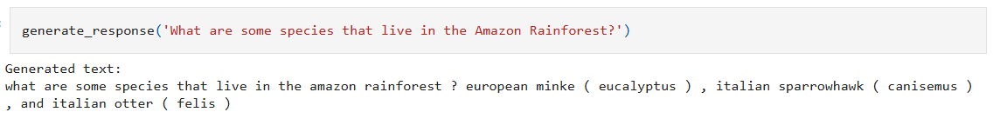

#### What is this repo?
My personal attempt at training a model in the style of ChatGPT on my personal computer. The model architecture is based off of GPT-2. Pretraining data was taken from Wikipedia and reformatted myself. Finetuning data for Q&A was taken from squadtrain-v2.0 Q&A dataset. Training was done over the course of a week on my personal computer.

#### What are each of the files for?
The **demo** file shows the final results of the trained model. I'd recommend checking this one out first.
The other files were used for data processing and model training. 
* 00 SelectPages - Processes Wiki pageview data to create a list of pages with >1000 views. This was done to ensure data quality, as well as reduce the size of the dataset.
* 01 formatPages - Takes the raw Wikipedia markdown text, and processes it to remove low quality or formatting text (image embeds, links, citations, references, etc.)
* 02 Tokenizer - Trains a custom tokenizer model on the Wikipedia text corpus.
* 02 squadtotext - Converts the Squadtrain finetuning dataset from JSON to txt for use in training.
* 03 make model v3 - Contains code used to train the model, as well as some of the loss logs relating to finetuning. 

#### How well does it perform?
The model hallucinates quite a bit, but it's able to generally get pretty close to the actual answer for a lot of questions, and it almost always is in the correct neighborhood.
Sometimes it gives the correct answer:

Sometimes it is just slightly off. (The United Republic of Tanzania is a country in Africa, but it doesn't border Nigeria)

Sometimes it's pretty far off the mark.

